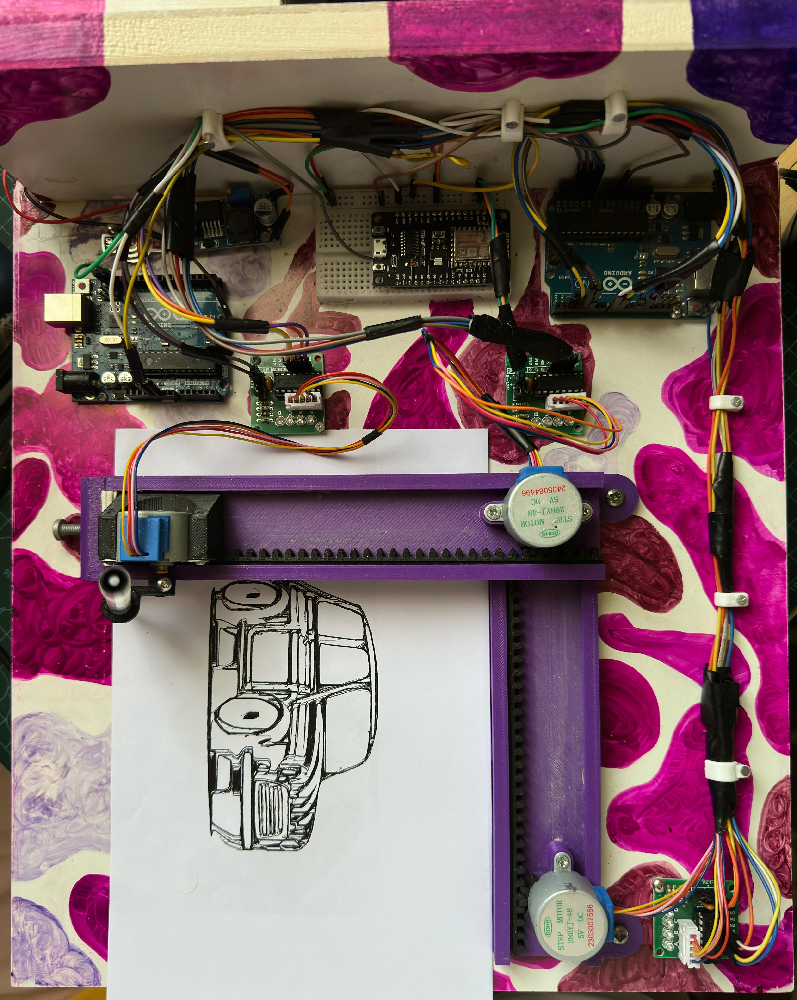

# 2D Printer - RoboTech 2025 Fair

 

## 📌 Project Overview

A custom 2D printer system that converts digital images to physical prints via SVG-to-Gcode conversion. Developed for the RoboTech 2025 Fair, this project includes complete hardware designs, firmware, and conversion software.

## 📚 Documentation
For detailed guides and tutorials, visit the [Project Wiki](https://github.com/mochi-002/RoboTech2025-PenPlotter/wiki).

## 📂 Repository Structure

```
/2d_printer---RoboTech_2025_Fair--
├── /gcode_settings/ # JSCut configuration profiles
├── /hardware/ # Mechanical designs
│ └── /3d_models/ # Printable STL files
├── /pictures/ # Image resources
│ ├── /converted_photos_to_svg/ # SVG outputs
│ ├── /images/ # Reference images
│ └── /photos_to_test_on/ # Sample input images
├── /printer_tests/ # Calibration files
│ └── /most_accurate_gcodes/ # Optimized print files
├── /software/ # Control system
│ ├── /arduino_grbl_code/ # Motion controller
│ ├── /esp_task/ # ESP32 modules
│ ├── /estimatedtime/ # Runtime predictor
│ └── /utlis/ # Conversion tools
├── requirements.txt # Python dependencies
└── arduino_requirements.txt # Arduino library dependencies
```
## 🛠️ Setup Guide

### Prerequisites
- Python 3.8+
- Arduino IDE 2.x
- GRBL-compatible CNC shield

### Python Dependencies
```bash
# Install Python packages
pip install -r requirements.txt
```

### arduino libilaries
- LiquidCrystal_I2C
- ESP8266WiFi
- WebSocketsServer
- grbl


### Hardware Assembly
1. Print all components from `hardware/3d_models`

### Software Installation
1. Upload `arduino_grbl_code.ino` to your controller
2. (Optional) Flash `esp_task.ino` for ESP32 modules
3. Install GRBL library using guides in `software/utlis/how_to_include_library`

## 🖨️ Usage Instructions

### Basic Workflow
```
Input Image → SVG Conversion by "picsvg.com" → resize svg by "inkscape" → G-code Generation by "jscut.org" → send gcode_file to arduino by "open builds" (case using the long way)
```
```
Input Image → Run gcode_generator.py → send gcode_file to arduino by "open builds" (case using the short way "mochi`s Method")
```

### Image Conversion:
```bash
python software/utlis/image_to_svg_converter.py -i pictures/photos_to_test_on/my_image.jpg
```

### G-code Generation:
```bash
python software/gcode_generator.py 
```

### Print Execution:
- Use preferred G-code sender (OpenBuilds recommended)
- Monitor progress with `estimatedtime.ino`

## ⚙️ Configuration

Modify `settings.jscut` for material-specific parameters:
- Cutting depth
- Feed rate
- Tool diameter

## 🧪 Testing & Calibration

- Pre-configured test files available in `printer_tests/`
- Start with files from `most_accurate_gcodes/` for known-good profiles

## 🤝 Contributing

We welcome contributions! Please:
1. Fork the repository
2. Create a feature branch (`git checkout -b feature/improvement`)
3. Commit your changes (`git commit -m 'Add new feature'`)
4. Push to the branch (`git push origin feature/improvement`)
5. Open a Pull Request

## 📜 License

Hardware designs licensed under MIT License. Software designed by mochi.

## 📧 Contact

- **Project Maintainer:** [mochi-002]
- **Email:** mohamed.002.mochi@gmail.com
- **Project Link:** https://github.com/mochi-002/2d_printer---RoboTech_2025_Fair--.git
- **Wiki Documentation:** https://github.com/mochi-002/RoboTech2025-PenPlotter/wiki
